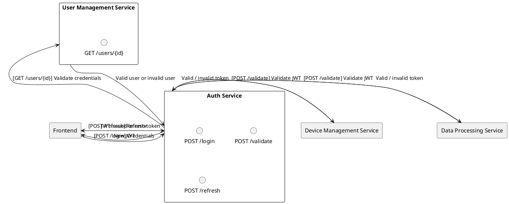
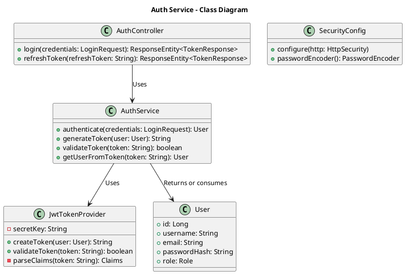

# Auth Service

## Overview
The Auth Service handles **authentication** and **authorization** in the IoT application. It issues and validates **JWT tokens** and delegates any user profile management to the **User Management Service**.

---

## Responsibilities
1. **Token Issuance & Validation**  
   - Issue JWTs upon successful user login.
   - Validate incoming JWTs for other microservices.
2. **Authorization Rules**  
   - Maintain a mapping of roles (`admin`, `user`) to specific permissions.
   - Provide a secure way for services (e.g., Device Management Service) to verify a user’s or device’s authorization levels.
3. **Endpoints**  
   - `/login`: Accepts credentials, issues JWT.  
   - `/validate`: Validates JWT for other services (internal endpoint).  
   - `/refresh`: Issues a new JWT if the current one is about to expire.  
   - **Best-Practice Suggestion:** For password resets and changes, the Auth Service can coordinate with the User Management Service. Implementation details vary depending on your security policies.

---

## Proposed Architecture

### Textual Description
1. **JWT Issuance**: When the user logs in (via the Frontend), the Auth Service checks credentials (in collaboration with the User Management Service) and issues a signed JWT.  
2. **JWT Validation**: Other services send the JWT to the Auth Service for validation or use a shared secret/public key approach to validate tokens independently.  
3. **Scalable Design**: Runs as a Spring Boot microservice, packaged in Docker. Can be deployed locally via Docker Compose or in production with K3s.

### Class diagram

**Diagram**
- **AuthController**: Exposes REST endpoints for login, token refresh.
- **AuthService**: Contains the core logic for authenticating a user (by contacting the User Management Service or checking cached info), generating/validating JWTs, and extracting user info from tokens.
- **JwtTokenProvider**: Handles the creation and validation of JWT tokens.
- **SecurityConfig**: Standard Spring Security configuration (e.g., HTTP security, password encoding).
- **User**: Typically fetched from the User Management Service. Shown here for clarity.

---

## Interfaces with Other Services

1. **User Management Service**
    - **Type**: Internal REST API
    - **Endpoints**: `GET /users/{id}` for credential checks (or `/users/validate`).
2. **Device Management Service**
    - **Type**: REST API calls for validating tokens.
3. **Data Processing Service**
    - **Type**: REST API calls for validating tokens.
4. **Frontend**
    - **Type**: REST (login, token refresh).

---

## Security & Maintenance
- **Best-Practice Suggestion**: Consider storing **client secrets** and **tokens** in a secure vault (e.g., HashiCorp Vault).
- **Best-Practice Suggestion**: Rotate JWT signing keys periodically for better security.
- **Auto-Scaling**: If user load spikes, replicate the Auth Service to handle more concurrent logins.

---