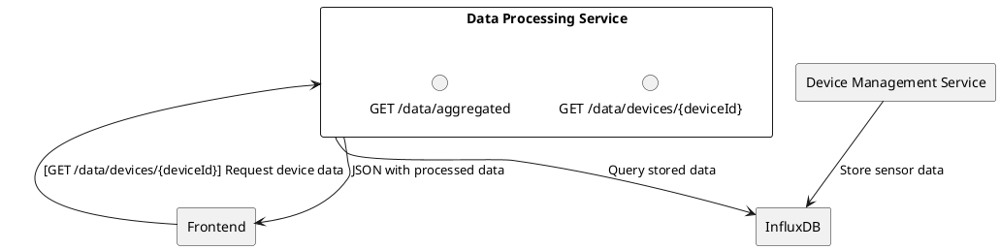
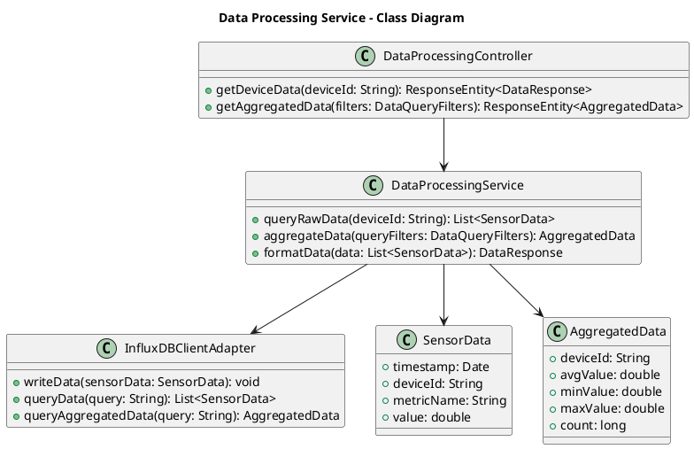

# Data Processing Service

## Overview
The “Data Processing Service” focuses on **outbound data** consumption and analytics. It aggregates data from the Device Management Service (or directly from the database) and provides an API for the Frontend to query **processed or formatted** data.

> **Note**: Since the Device Management Service is ingesting data, this service primarily handles retrieving, aggregating, transforming, and serving data.

---

## Responsibilities
1. **Data Query & Aggregation**
    - Provide endpoints for historical data, real-time aggregated data, and preformatted responses for the Frontend.
2. **Data Retention, Archiving & Downsampling**
    - **Best-Practice Suggestion**: Offload retention policies to InfluxDB or implement custom archiving routines (e.g., move older data to cheaper storage).
3. **Data Formatting & Visualization**
    - Prepare data in a format suitable for charting or dashboards on the Frontend.

---

## Proposed Architecture

### Textual Description
- **Input**: Data is stored in InfluxDB or PostgreSQL by the Device Management Service.
- **Processing**: Implement any business logic or analytics needed (e.g., aggregations, min/max/avg calculations).
- **Output**: Serve data via RESTful endpoints for the Frontend.

### Class diagram

**Diagram**

- **DataProcessingController**: REST endpoints for retrieving device data, aggregated metrics, or reports.
- **DataProcessingService**: Core logic to query, aggregate, and format data from InfluxDB (or another time-series DB).
- **InfluxDBClientAdapter**: Custom wrapper that executes Influx queries and returns domain objects.
- **SensorData**: Represents raw sensor readings.
- **AggregatedData**: Represents summarized data (avg, min, max).

---

## Interfaces
1. **InfluxDB**
    - **Type**: Database connection (time-series)
    - **Purpose**: Storing and querying device telemetry.
2. **Frontend**
    - **Type**: REST
    - **Endpoints**:
        - `GET /data/devices/{deviceId}` for raw or lightly processed data.
        - `GET /data/aggregated` for aggregated metrics.
3. **Device Management Service**
    - **Type**: Database concurrency or optional direct API calls if needed.

---

## Data Retention & Archiving
- **Best-Practice Suggestion**:
    - Use **InfluxDB’s** retention policies to automatically drop or downsample old data.
    - For extremely large data volumes, consider moving cold data to cheaper storage (S3, long-term archives).

---

## Security & Maintenance
- **Best-Practice Suggestion**: Restrict direct access to the InfluxDB database. Only allow the Data Processing Service to query it.
- **Scalability**: If data volume grows, horizontally scale the service. Partition data by device or time range as needed.

---