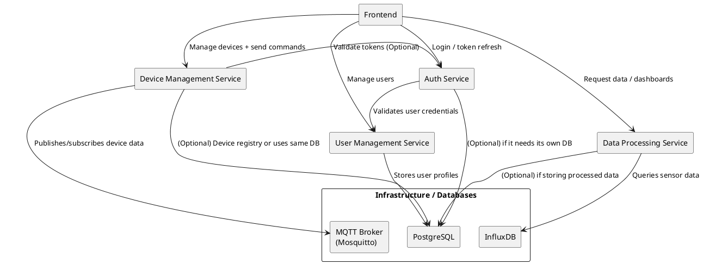

# Dependency Overview

The following diagram and explanation show how each service depends on others.
When a service depends on another, it means it either needs it for **runtime**
(e.g., token validation) or for **initial configuration** (e.g., database migrations).

---

## Explanation of Key Dependencies

1. **Infrastructure / Databases**
    - **PostgreSQL**: Used by the **User Management Service** (and optionally by the **Auth Service** if needed).
    - **InfluxDB**: Used by the **Data Processing Service** to store/query time-series data.
    - **MQTT Broker (Mosquitto)**: Used by the **Device Management Service** for publish/subscribe communication with IoT devices.

2. **User Management Service (UMS)**
    - Needs a running **PostgreSQL** database.
    - Provides user profile data; the Auth Service may query or verify user details through it.

3. **Auth Service**
    - Relies on **User Management Service** to validate user credentials (or at least to confirm user existence/roles).
    - May also have its own database for tokens or session data (optional, depending on implementation).

4. **Device Management Service (DMS)**
    - Uses the **MQTT Broker** for device communication.
    - May validate tokens via the **Auth Service** if you choose a centralized approach for device authentication.
    - Optionally uses **PostgreSQL** to maintain a device registry (if you store device metadata or last-seen timestamps outside of InfluxDB).

5. **Data Processing Service (DPS)**
    - Pulls sensor data from **InfluxDB** (or from the DMS if you design an intermediary queue).
    - Provides aggregated or formatted data via its REST API to the Frontend.

6. **Frontend**
    - Communicates with **Auth Service** for login and token refresh.
    - Communicates with **User Management Service** for user admin tasks.
    - Communicates with **Device Management Service** for device controls, status, commands.
    - Communicates with **Data Processing Service** to fetch and visualize processed data.

---

# Priority List (Development & Deployment)

Below is a **suggested** order for development and deployment. You can adapt it based on your team’s workflow or if you want to develop certain parts in parallel.

1. **Infrastructure & Databases**
    - Set up **PostgreSQL**, **InfluxDB**, and the **MQTT Broker**.
    - Rationale: All subsequent services need these components running to store data or communicate.

2. **User Management Service**
    - Develop core user CRUD, roles, and basic endpoints.
    - Rationale: The Auth Service will require a functioning user database to validate credentials and roles.

3. **Auth Service**
    - Implement login, token issuance, and validation.
    - Integrate with the User Management Service for credential checks.
    - Rationale: Secure endpoints for other services, and the frontend needs a way to authenticate.

4. **Device Management Service**
    - Implement device registry, MQTT subscriptions/publications, token validation (if using the Auth Service).
    - Rationale: Core IoT functionality—once devices can register and send data, you can begin end-to-end testing.

5. **Data Processing Service**
    - Implement queries on InfluxDB, data aggregation, optional transformations.
    - Provide REST APIs to the Frontend.
    - Rationale: You can start collecting data from devices, then process and serve it.

6. **Frontend**
    - Implement React components for user login (Auth integration), device views (Device Mgmt), and data dashboards (Data Processing).
    - Rationale: With backend services in place, the frontend can be integrated end-to-end.

7. **Alerts & Notifications** (Optional Step / Ongoing)
    - Implement device offline detection or threshold-based alerts once the above services are stable.
    - Rationale: This can be integrated into the Device Management Service or a separate module, but it depends on the core services being in place.

---

## Notes & Recommendations

- **Parallel Development**
    - Teams can develop services in parallel using mocks or stubs. For instance, the Auth Service can provide a mocked user validation response to the Device Management Service until the UMS is complete.

- **Testing & CI/CD**
    - Each service can have its own test suite and pipeline (e.g., GitHub Actions).
    - A combined `docker-compose.yml` or K3s deployment configuration can bring everything up in a local/CI environment for integration tests.

- **Versioning**
    - Keep each microservice versioned separately. Increment versions in lockstep if there are changes to shared interfaces (e.g., Auth token format).

---

**In summary**:
1. Get your **infrastructure** up and running (DBs + MQTT).
2. Build out **User Management** so the Auth Service has a place to validate users.
3. Create the **Auth Service** to secure your system.
4. Develop the **Device Management** next so devices can push data.
5. Build the **Data Processing** service for data retrieval and analytics.
6. Finally, hook it all together with the **Frontend** for a complete end-to-end solution.
