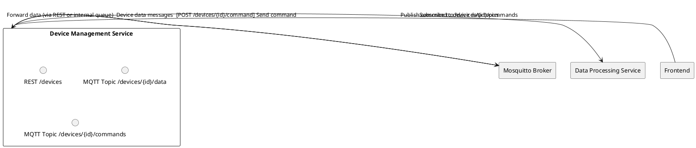
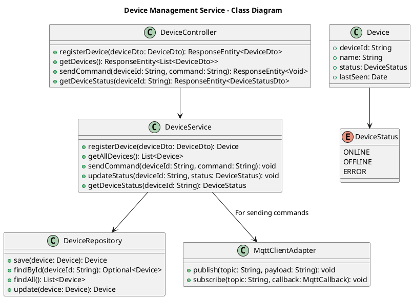

# Device Management Service

## Overview
The Device Management Service handles **IoT device registration, status monitoring, inbound data ingestion, and outbound commands** via **MQTT**.

---

## Responsibilities
1. **Device Registration & Authentication**
    - Maintain a registry of IoT devices (unique IDs, status, metadata).
    - Provide an authentication mechanism for devices.
    - **Best-Practice Suggestion**: Use a device-specific token or certificate; can be managed here or via the Auth Service for a unified approach.
2. **Inbound Data Handling**
    - Subscribe to MQTT topics for incoming sensor data or device events.
    - Update device statuses.
    - Forward or store sensor data (e.g., in InfluxDB or queue for the Data Processing Service).
3. **Command & Control**
    - Send commands to devices over MQTT topics (triggered by frontend actions or automation rules).
4. **Device Offline Alerts**
    - Detect devices that fail to send “heartbeat” or data within a configured interval.
    - Trigger alerts or notifications.

---

## Proposed Architecture

### Textual Description
1. **MQTT Broker**: Using **Mosquitto** to handle publish/subscribe.
2. **Device Registry**: A table storing device info (device ID, status, last-seen timestamp).
3. **Inbound Data Flow**: MQTT -> Device Management -> (optional) Data Processing or database.
4. **Outbound Commands**: Frontend -> Device Management -> MQTT -> Device.

### Class diagram

**Diagram**

- **DeviceController**: REST endpoints to manage devices (registration, listing, sending commands).
- **DeviceService**: Business logic, updates device statuses, manages MQTT interactions, etc.
- **DeviceRepository**: Persistence logic for storing and retrieving device data.
- **MqttClientAdapter**: A wrapper or adapter around the MQTT library (e.g., Paho, Eclipse) for publish/subscribe.
- **Device**: Entity representing an IoT device record.
- **DeviceStatus**: Enum for device states.

---

## Interfaces
1. **MQTT Broker (Mosquitto)**
    - **Type**: MQTT
    - **Purpose**: Pub/Sub transport for device data and commands.
2. **Data Processing Service**
    - **Type**: REST or internal message queue
    - **Purpose**: Forward sensor data for analysis and storage.
3. **Frontend**
    - **Type**: REST
    - **Endpoints**:
        - `GET /devices` (list devices)
        - `POST /devices` (register new device)
        - `POST /devices/{id}/command` (send command)

---

## Database
- **Device Registry**: PostgreSQL or a simple key-value store to keep track of device info.
- **Last-Seen & Status**: Keep track of timestamps to alert if a device is offline.

---

## Security & Maintenance
- **Best-Practice Suggestion**: If the device secrets are stored here, encrypt them at rest.
- **Offline Alert**: Poll or event-driven detection for inactivity.

---