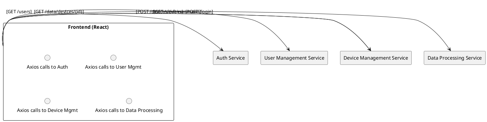

# Frontend

## Overview
A **React**-based web application that provides a user interface for managing devices, visualizing data, and performing user administration tasks. Uses **Bootstrap / React-Bootstrap** for styling, **Axios** for HTTP requests, and **React Router** for navigation.

---

## Responsibilities
1. **User Interface**
    - Device registration & management pages
    - Data visualization dashboards (historical & real-time data)
    - User account settings (password change, profile info)
2. **Integration with Microservices**
    - Communicates with Auth Service for login & token refresh.
    - Calls User Management Service for user account operations.
    - Interacts with Device Management Service to send device commands and retrieve device statuses.
    - Fetches processed/aggregated data from the Data Processing Service.
3. **Alerts & Notifications**
    - Display alerts if a device is offline for longer than a configured threshold (server-side detection).

---

## Proposed Architecture

### Textual Description
- **React**: Single-Page Application (SPA)
- **API Calls**:
    - Auth: `/login`, `/refresh`
    - Users: `/users`, `/users/{id}`
    - Devices: `/devices`, `/devices/{id}`, `/devices/{id}/command`
    - Data: `/data/devices/{id}`, `/data/aggregated`
- **Docker**: Packaged for containerized deployments.
- **Routing**: React Router for client-side navigation.

### PlantUML Diagram

---

## Interfaces
1. **Auth Service**
    - **Type**: REST (login, refresh)
    - **JWT**: Stored in browser (HTTP-only cookie or local storage).
2. **User Management Service**
    - **Type**: REST (user operations).
3. **Device Management Service**
    - **Type**: REST (device operations, command sending).
4. **Data Processing Service**
    - **Type**: REST (data visualization).
5. **Docker**
    - For local dev, the frontend is built and served in a Docker container, or can be run with npm/yarn.

---

## Deployment & Maintenance
- **Development**: Start with `npm start` or `docker-compose up`.
- **Production**: Build Docker image, serve via Nginx or other static file server.
- **CI/CD**: GitHub Actions can build and push the container automatically.

---

## Best-Practice Suggestions
- **Security**: Consider using **HTTP-only cookies** for JWT tokens to reduce XSS risk.
- **Performance**: Implement lazy loading for heavy components.
- **Testing**: Integrate with React Testing Library and/or Cypress for end-to-end tests.

---